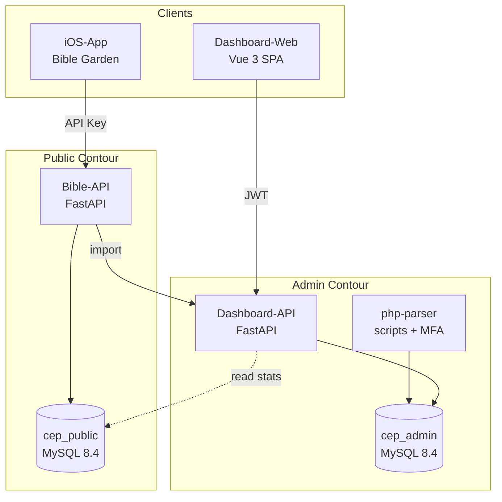
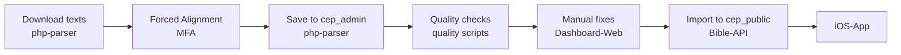
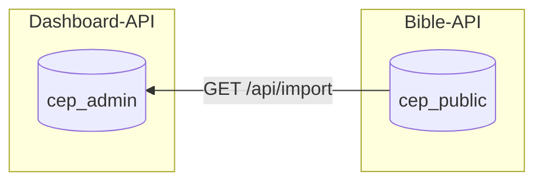
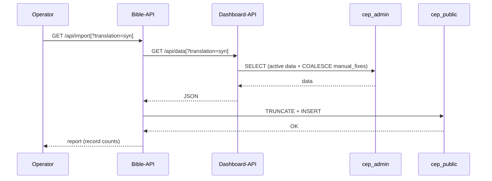
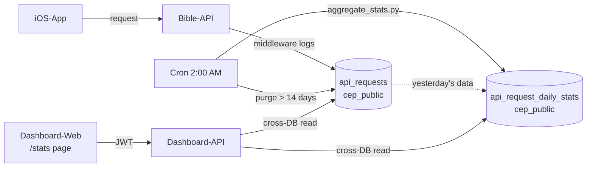

# Bible Garden Architecture

## 1. Overview

The system consists of two API services, an admin dashboard, and a data pipeline for data preparation.

**Principle**: data is prepared in the admin contour, and only verified and finalized data reaches the public contour via export.



## 2. GitHub Repositories

All repositories are under the [Bible-Garden](https://github.com/Bible-Garden) organization.

| Repository | Local directory | Description |
|------------|----------------|-------------|
| [Bible-API](https://github.com/Bible-Garden/Bible-API) | `public-api/` | Public read-only API for the iOS app |
| [Dashboard-API](https://github.com/Bible-Garden/Dashboard-API) | `admin-api/` | Admin API — data management, quality control, export |
| [Dashboard-Web](https://github.com/Bible-Garden/Dashboard-Web) | `dashboard/` | Vue 3 admin dashboard — alignment review and QC |
| [iOS-App](https://github.com/Bible-Garden/iOS-App) | — | Bible Garden iOS app |
| [Architecture](https://github.com/Bible-Garden/Architecture) | `architect/` | This documentation |

## 3. Data Flow



### What happens at each step

1. **php-parser** downloads Bible texts from open sources
2. **MFA** aligns text with audio (word-level timestamps)
3. Results are saved to `cep_admin` database (voice_alignments, voice_chapters)
4. **Python scripts** analyze quality and write anomalies to voice_anomalies
5. Operator uses **Dashboard-Web** to review anomalies and apply manual corrections (voice_manual_fixes)
6. **Bible-API** fetches data from Dashboard-API and loads it into `cep_public` (manual_fixes applied)
7. **iOS-App** receives clean data via Bible-API

## 4. Services

### Bible-API

Public read-only API for the iOS app. Minimal, fast, no DB writes (except import and request logging).

- **Repo**: [Bible-Garden/Bible-API](https://github.com/Bible-Garden/Bible-API)
- **Port**: 8084
- **Auth**: API Key (`X-API-Key`)
- **DB**: `cep_public` (SELECT only, INSERT during import and request stats logging)
- **Production**: `https://api.bible.garden/api`
- **Request stats**: middleware logs every request to `api_requests` table (fire-and-forget, background thread)

### Dashboard-API

API for the dashboard and data management. Read + write.

- **Repo**: [Bible-Garden/Dashboard-API](https://github.com/Bible-Garden/Dashboard-API)
- **Port**: 8085
- **Auth**: JWT (admin endpoints), API Key (read endpoints)
- **DB**: `cep_admin` (full access), `cep_public` (read-only, for API stats)

### Dashboard-Web

Vue 3 SPA for reviewing and correcting forced alignment.

- **Repo**: [Bible-Garden/Dashboard-Web](https://github.com/Bible-Garden/Dashboard-Web)
- **Port**: 5174
- **Stack**: Vue 3, TypeScript, PrimeVue, TailwindCSS, Chart.js
- **Connects to**: Dashboard-API (`/bible-api` proxy), alignment-api (`/alignment-api` proxy)
- **Pages**: Voices, Anomalies, Inspect, Alignment Tasks, API Stats

### php-parser

Data pipeline: text downloading, forced alignment, DB loading. Not a running service — utility scripts.

- **Stack**: PHP 8.3, Python 3, MFA (Docker), ffmpeg
- **DB**: `cep_admin` (direct write)

### iOS-App

Bible Garden iOS app — listen to the Bible with pauses and multilingual verse-by-verse playback.

- **Repo**: [Bible-Garden/iOS-App](https://github.com/Bible-Garden/iOS-App)
- **Connects to**: Bible-API (`https://api.bible.garden/api`)

## 5. Endpoints

### Bible-API

| Method | Path | Tag |
|--------|------|-----|
| GET | `/api/languages` | Languages |
| GET | `/api/translations` | Translations |
| GET | `/api/translations/{code}/books` | Translations |
| GET | `/api/excerpt_with_alignment` | Excerpts |
| GET/HEAD | `/api/audio/{translation}/{voice}/{book}/{chapter}.mp3` | Audio |
| GET | `/api/about` | About |
| GET | `/api/version-check` | Version |
| POST | `/api/cache/clear` | Cache |
| GET | `/api/import` | Import |

Bible-API also runs `RequestStatsMiddleware` that logs every request (except /docs, /openapi.json, /redoc, /favicon.ico) to `api_requests` table. Dynamic paths are normalized (e.g. `/api/audio/*`, `/api/translations/*/books`).

### Dashboard-API

| Method | Path | Tag | Auth |
|--------|------|-----|------|
| POST | `/api/auth/login` | Auth | — |
| GET | `/api/languages` | Languages | API Key |
| GET | `/api/translations` | Translations | API Key |
| GET | `/api/translation_info` | Translations | API Key |
| GET | `/api/translations/{code}/books` | Translations | API Key |
| GET | `/api/excerpt_with_alignment` | Excerpts | API Key |
| GET | `/api/chapter_with_alignment` | Excerpts | API Key |
| GET/HEAD | `/api/audio/{translation}/{voice}/{book}/{chapter}.mp3` | Audio | API Key |
| PUT | `/api/translations/{code}` | Admin | JWT |
| PUT | `/api/voices/{code}` | Admin | JWT |
| GET | `/api/voices/{code}/anomalies` | Admin | JWT |
| POST | `/api/voices/anomalies` | Admin | JWT |
| PATCH | `/api/voices/anomalies/{code}/status` | Admin | JWT |
| POST | `/api/voices/manual-fixes` | Admin | JWT |
| GET | `/api/check_translation` | Admin | JWT |
| GET | `/api/check_voice` | Admin | JWT |
| POST | `/api/cache/clear` | Admin | JWT |
| GET | `/api/data` | Export | API Key |
| GET | `/api/stats/summary?days=30` | Statistics | JWT |
| GET | `/api/stats/recent?limit=50` | Statistics | JWT |

## 6. Databases

### cep_public (public, read-only)

Contains only finalized data for the iOS app.

| Table | Purpose |
|-------|---------|
| `languages` | Languages (en, ru, uk) |
| `bible_books` | Bible book reference (66 books) |
| `translations` | Translations (active=1 only) |
| `translation_books` | Books per translation |
| `translation_verses` | Verse texts |
| `translation_titles` | Section headings |
| `translation_notes` | Verse footnotes |
| `voices` | Voices (active=1 only) |
| `voice_alignments` | Verse timings (with manual_fixes applied) |
| `api_requests` | Raw API request log (14-day retention) |
| `api_request_daily_stats` | Aggregated daily API stats (permanent) |

### cep_admin (admin, full access)

Contains all data, including working and technical tables.

| Table | Purpose |
|-------|---------|
| `languages` | Languages |
| `bible_books` | Bible book reference |
| `bible_stat` | Expected verse counts (for integrity checks) |
| `translations` | All translations (including inactive) |
| `translation_books` | Books per translation |
| `translation_verses` | Verse texts |
| `translation_titles` | Section headings |
| `translation_notes` | Verse footnotes |
| `voices` | All voices (including inactive) |
| `voice_alignments` | Verse timings (original, from MFA) |
| `voice_manual_fixes` | Manual timing corrections |
| `voice_anomalies` | Detected alignment anomalies |
| `voice_chapters` | MFA technical data (input/output/timecodes) |
| `phinxlog` | Migration history |

### Database relationship



During import, Bible-API calls `GET /api/data` on Dashboard-API. On the Dashboard-API side, `COALESCE(vmf.begin, va.begin)` is applied — `cep_public.voice_alignments` receives the final values. Bible-API works without COALESCE.

## 7. Directory Structure

```
cep/
├── public-api/          # Bible-API (FastAPI) — github.com/Bible-Garden/Bible-API
│   ├── app/
│   │   ├── main.py            # Entry point, routers
│   │   ├── excerpt.py         # Content endpoint (simplified, no COALESCE)
│   │   ├── audio.py           # MP3 streaming with Range support
│   │   ├── about.py           # About page
│   │   ├── version_check.py   # Version check
│   │   ├── import_data.py     # Data import from Dashboard-API
│   │   ├── middleware.py       # RequestStatsMiddleware (logs requests to DB)
│   │   ├── aggregate_stats.py # Daily stats aggregation (cron)
│   │   ├── auth.py            # API Key only
│   │   ├── models.py          # Pydantic models
│   │   ├── database.py        # Connection to cep_public
│   │   └── config.py          # Env variables
│   ├── Dockerfile
│   └── docker-compose.yml
│
├── admin-api/           # Dashboard-API (FastAPI) — github.com/Bible-Garden/Dashboard-API
│   ├── app/
│   │   ├── main.py            # Entry point, all admin endpoints
│   │   ├── excerpt.py         # Content endpoints (with COALESCE)
│   │   ├── audio.py           # MP3 streaming with Range support
│   │   ├── checks.py          # Integrity checks
│   │   ├── auth.py            # API Key + JWT
│   │   ├── data.py            # Data export for Bible-API
│   │   ├── stats.py           # API usage statistics (reads cep_public)
│   │   ├── models.py          # Pydantic models
│   │   ├── database.py        # Connection to cep_admin
│   │   └── config.py          # Env variables
│   ├── migrations/
│   ├── Dockerfile
│   └── docker-compose.yml
│
├── dashboard/           # Dashboard-Web (Vue 3) — github.com/Bible-Garden/Dashboard-Web
│   ├── src/
│   │   ├── Components/        # Vue components
│   │   ├── composables/       # useApi, useAuth, useAlignmentTasks, useAudioPlayback
│   │   ├── services/          # api.ts (axios), auth.ts (JWT)
│   │   ├── config/            # api.ts (endpoints config)
│   │   ├── types/             # TypeScript types
│   │   ├── utils/             # audio.ts
│   │   └── router/            # Vue Router
│   ├── Dockerfile
│   └── docker-compose.yml
│
├── php-parser/          # Data pipeline (not on GitHub)
│   ├── alignment/             # Forced alignment (MFA)
│   ├── parsing/               # Text parsing
│   ├── quality/               # Anomaly analysis scripts
│   ├── audio/                 # Audio processing
│   └── api/                   # Minimal FastAPI (health check only)
│
├── db/                  # Database setup
│   ├── docker-compose.yml     # MySQL 8.4 (port 3308)
│   └── setup_cep_public.sql   # DDL for cep_public
│
└── architect/           # Architecture — github.com/Bible-Garden/Architecture
    └── architecture.md
```

## 8. Docker Compose

Each service has its own `docker-compose.yml`. MySQL is shared via the `mysql_default` network.

```yaml
# db/docker-compose.yml
services:
  mysql:
    image: mysql:8.4
    container_name: cep-mysql
    ports: ["3308:3306"]

# public-api/docker-compose.yml
services:
  public-api:
    build: .
    ports: ["8084:8000"]
    env_file: .env
    volumes:
      - ${AUDIO_DIR}:/audio
    networks: [mysql_default]

# admin-api/docker-compose.yml
services:
  admin-api:
    build: .
    ports: ["8085:8000"]
    env_file: .env
    volumes:
      - ${AUDIO_DIR}:/audio
    networks: [mysql_default]

# dashboard/docker-compose.yml
services:
  dashboard:
    build: .
    container_name: bible-dashboard
    ports: ["5174:5173"]
```

## 9. Production

- `bible.garden` — static site only (no API)
- `api.bible.garden` — Bible-API (public read-only)
- SSL via Let's Encrypt, nginx as reverse proxy
- Import is done per-translation to keep memory usage low

## 12. Data Import

Each service owns its own database. Data is transferred via API, not by direct access to another service's DB. Bible-API fetches data from Dashboard-API.



## 11. API Request Statistics

Tracks Bible-API (public-api) usage to monitor iOS app activity.

### Architecture



### Components

- **Bible-API `middleware.py`**: `RequestStatsMiddleware` — logs every request in a background thread. Normalizes dynamic paths (`/api/audio/*`, `/api/translations/*/books`). Excludes `/docs`, `/openapi.json`, `/redoc`, `/favicon.ico`.
- **Bible-API `aggregate_stats.py`**: Cron script (`0 2 * * *`) — aggregates yesterday's raw data into `api_request_daily_stats`, purges raw records older than 14 days.
- **Dashboard-API `stats.py`**: Two JWT-protected endpoints — `GET /api/stats/summary?days=30` (totals, daily breakdown, top endpoints, today's live data) and `GET /api/stats/recent?limit=50` (raw recent requests). Reads from `cep_public` via cross-DB queries.
- **Dashboard-Web `ApiStats.vue`**: Summary cards, daily requests line chart (Chart.js), top endpoints table, recent requests table with pagination and period selector (7/30/90 days).

### Tables (in cep_public)

| Table | Retention | Purpose |
|-------|-----------|---------|
| `api_requests` | 14 days | Raw request log (endpoint, method, status, response_time_ms, client_ip, user_agent) |
| `api_request_daily_stats` | Permanent | Aggregated per day+endpoint (request_count, unique_ips, avg_response_time_ms, error_count) |

### Dashboard-API: `GET /api/data[?translation=alias]`

Returns finalized data as JSON. The `translation` parameter (translation alias) is optional.

**Without parameter** — all active data:
1. Reference tables: `languages`, `bible_books`
2. All active translations: `translations` (active=1) + `translation_books`, `translation_verses`, `translation_titles`, `translation_notes`
3. All active voices: `voices` (active=1)
4. `voice_alignments` with COALESCE(vmf.begin, va.begin) applied

**With parameter** `?translation=syn` — single translation data:
1. Reference tables: `languages`, `bible_books`
2. Specified translation + its `translation_books`, `translation_verses`, `translation_titles`, `translation_notes`
3. Voices for this translation: `voices` (active=1)
4. `voice_alignments` for this translation only

### Bible-API: `GET /api/import[?translation=alias]`

Calls Dashboard-API, fetches data, loads into `cep_public`:

**Without parameter** — full resync:
1. Requests `GET /api/data` from Dashboard-API
2. Clears all target tables
3. Inserts received data
4. Returns report: record count per table

**With parameter** `?translation=syn` — single translation update:
1. Requests `GET /api/data?translation=syn` from Dashboard-API
2. Deletes this translation's data from `cep_public`
3. Inserts received data
4. Reference tables (`languages`, `bible_books`) are always updated
5. Returns report
