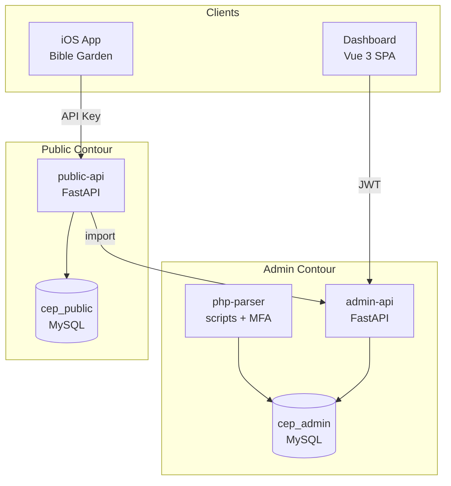
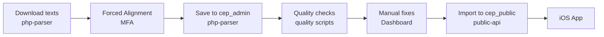
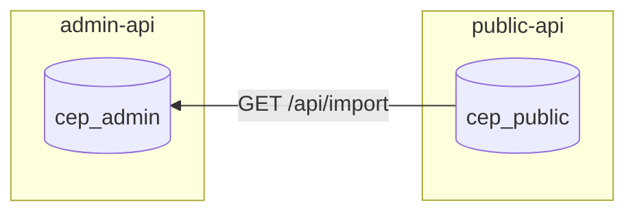
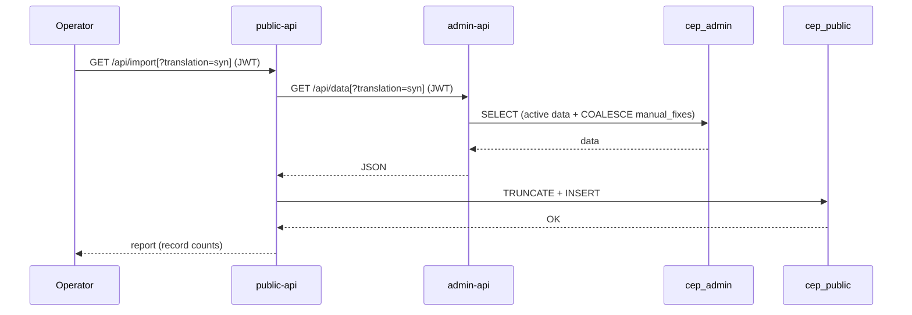

# Bible Garden Architecture

## 1. Overview

The system consists of two API services, an admin dashboard, and a data pipeline for data preparation.

**Principle**: data is prepared in the admin contour, and only verified and finalized data reaches the public contour via export.



## 2. Data Flow



### What happens at each step

1. **php-parser** downloads Bible texts from open sources
2. **MFA** aligns text with audio (word-level timestamps)
3. Results are saved to `cep_admin` database (voice_alignments, voice_chapters)
4. **Python scripts** analyze quality and write anomalies to voice_anomalies
5. Operator uses **Dashboard** to review anomalies and apply manual corrections (voice_manual_fixes)
6. **public-api** fetches data from admin-api and loads it into `cep_public` (manual_fixes applied)
7. **iOS app** receives clean data via public-api

## 3. Services

### public-api

Public read-only API for the iOS app. Minimal, fast, no DB writes.

- **Port**: 8084
- **Auth**: API Key (`X-API-Key`)
- **DB**: `cep_public` (SELECT only)

### admin-api

API for the dashboard and data management. Read + write.

- **Port**: 8085
- **Auth**: JWT (admin endpoints), API Key (read endpoints for dashboard)
- **DB**: `cep_admin` (full access)

### Dashboard

Vue 3 SPA for reviewing and correcting forced alignment.

- **Port**: 5174
- **Stack**: Vue 3, TypeScript, PrimeVue, TailwindCSS
- **Connects to**: admin-api, alignment-api

### php-parser

Data pipeline: text downloading, forced alignment, DB loading.

- **Stack**: PHP 8.3, Python 3, MFA (Docker)
- **DB**: `cep_admin` (direct write)

## 4. Endpoints

### public-api

| Method | Path | Tag |
|--------|------|-----|
| GET | `/api/languages` | Languages |
| GET | `/api/translations` | Translations |
| GET | `/api/translations/{code}/books` | Translations |
| GET | `/api/excerpt_with_alignment` | Excerpts |
| GET | `/api/audio/{translation}/{voice}/{book}/{chapter}.mp3` | Audio |
| GET | `/api/about` | About |
| GET | `/api/version-check` | Version |
| GET | `/api/import` | Import |

### admin-api

| Method | Path | Tag | Auth |
|--------|------|-----|------|
| POST | `/api/auth/login` | Auth | - |
| GET | `/api/languages` | Languages | API Key |
| GET | `/api/translations` | Translations | API Key |
| GET | `/api/translation_info` | Translations | API Key |
| GET | `/api/translations/{code}/books` | Translations | API Key |
| GET | `/api/excerpt_with_alignment` | Excerpts | API Key |
| GET | `/api/chapter_with_alignment` | Excerpts | API Key |
| GET | `/api/audio/{translation}/{voice}/{book}/{chapter}.mp3` | Audio | API Key |
| PUT | `/api/translations/{code}` | Admin | JWT |
| PUT | `/api/voices/{code}` | Admin | JWT |
| GET | `/api/voices/{code}/anomalies` | Admin | JWT |
| POST | `/api/voices/anomalies` | Admin | JWT |
| PATCH | `/api/voices/anomalies/{code}/status` | Admin | JWT |
| POST | `/api/voices/manual-fixes` | Admin | JWT |
| GET | `/api/check_translation` | Admin | JWT |
| GET | `/api/check_voice` | Admin | JWT |
| POST | `/api/cache/clear` | Admin | JWT |
| GET | `/api/data` | Admin | JWT |

## 5. Databases

### cep_public (public, read-only)

Contains only finalized data for the iOS app.

| Table | Purpose |
|-------|---------|
| `languages` | Languages (en, ru, uk) |
| `bible_books` | Bible book reference (66 books) |
| `translations` | Translations (active=1 only) |
| `translation_books` | Books per translation |
| `translation_verses` | Verse texts |
| `translation_titles` | Section headings |
| `translation_notes` | Verse footnotes |
| `voices` | Voices (active=1 only) |
| `voice_alignments` | Verse timings (with manual_fixes applied) |

### cep_admin (admin, full access)

Contains all data, including working and technical tables.

| Table | Purpose |
|-------|---------|
| `languages` | Languages |
| `bible_books` | Bible book reference |
| `bible_stat` | Expected verse counts (for integrity checks) |
| `translations` | All translations (including inactive) |
| `translation_books` | Books per translation |
| `translation_verses` | Verse texts |
| `translation_titles` | Section headings |
| `translation_notes` | Verse footnotes |
| `voices` | All voices (including inactive) |
| `voice_alignments` | Verse timings (original, from MFA) |
| `voice_manual_fixes` | Manual timing corrections |
| `voice_anomalies` | Detected alignment anomalies |
| `voice_chapters` | MFA technical data (input/output/timecodes) |
| `phinxlog` | Migration history |

### Database relationship



During import, public-api calls `GET /api/export` on admin-api. On the admin-api side, `COALESCE(vmf.begin, va.begin)` is applied — `cep_public.voice_alignments` receives the final values. Public-api works without COALESCE.

## 6. Directory Structure

```
/root/cep/
├── public-api/          # Public API (FastAPI)
│   ├── app/
│   │   ├── main.py            # Entry point, routers
│   │   ├── excerpt.py         # Content endpoints (simplified, no COALESCE)
│   │   ├── audio.py           # MP3 streaming
│   │   ├── about.py           # About page
│   │   ├── version_check.py   # Version check
│   │   ├── import_data.py     # Data import from admin-api
│   │   ├── auth.py            # API Key only
│   │   ├── models.py          # Pydantic models
│   │   ├── database.py        # Connection to cep_public
│   │   └── config.py          # Env variables
│   ├── Dockerfile
│   ├── docker-compose.yml
│   └── openapi.yaml
│
├── admin-api/           # Admin API (FastAPI)
│   ├── app/
│   │   ├── main.py            # Entry point, all admin endpoints
│   │   ├── excerpt.py         # Content endpoints (with COALESCE)
│   │   ├── audio.py           # MP3 streaming
│   │   ├── checks.py          # Integrity checks
│   │   ├── auth.py            # API Key + JWT
│   │   ├── data.py            # Data export for public-api
│   │   ├── models.py          # Pydantic models
│   │   ├── database.py        # Connection to cep_admin
│   │   └── config.py          # Env variables
│   ├── migrations/
│   ├── Dockerfile
│   ├── docker-compose.yml
│   └── openapi.yaml
│
├── dashboard/                 # Admin panel (Vue 3)
│   ├── src/
│   ├── Dockerfile
│   └── docker-compose.yml
│
├── php-parser/                # Data pipeline
│   ├── alignment/             # Forced alignment (MFA)
│   ├── saving/                # Save to DB
│   ├── quality/               # Anomaly analysis scripts
│   └── ...
│
└── architect/                 # This documentation
    └── architecture.md
```

## 7. Docker Compose (target state)

```yaml
services:
  public-api:
    build: ./public-api
    ports: ["8084:8000"]
    environment:
      DB_NAME: cep_public
    volumes:
      - ${AUDIO_DIR}:/audio

  admin-api:
    build: ./admin-api
    ports: ["8085:8000"]
    environment:
      DB_NAME: cep_admin
    volumes:
      - ${AUDIO_DIR}:/audio

  dashboard:
    build: ./dashboard
    ports: ["5174:5173"]
```

MySQL remains an external service (both databases on the same MySQL server).

## 8. Data Import

Each service owns its own database. Data is transferred via API, not by direct access to another service's DB. Public-api fetches data from admin-api.



### admin-api: `GET /api/data[?translation=alias]`

Returns finalized data as JSON. The `translation` parameter (translation alias) is optional.

**Without parameter** — all active data:
1. Reference tables: `languages`, `bible_books`
2. All active translations: `translations` (active=1) + `translation_books`, `translation_verses`, `translation_titles`, `translation_notes`
3. All active voices: `voices` (active=1)
4. `voice_alignments` with COALESCE(vmf.begin, va.begin) applied

**With parameter** `?translation=syn` — single translation data:
1. Reference tables: `languages`, `bible_books`
2. Specified translation + its `translation_books`, `translation_verses`, `translation_titles`, `translation_notes`
3. Voices for this translation: `voices` (active=1)
4. `voice_alignments` for this translation only

### public-api: `GET /api/import[?translation=alias]`

Calls admin-api, fetches data, loads into `cep_public`:

**Without parameter** — full resync:
1. Requests `GET /api/data` from admin-api
2. Clears all target tables
3. Inserts received data
4. Returns report: record count per table

**With parameter** `?translation=syn` — single translation update:
1. Requests `GET /api/data?translation=syn` from admin-api
2. Deletes this translation's data from `cep_public`
3. Inserts received data
4. Reference tables (`languages`, `bible_books`) are always updated
5. Returns report

Run: `GET /api/import` or `python import_data.py [--translation=syn]` from CLI.

## 9. Migration Plan

| Step | Action | Result |
|------|--------|--------|
| 1 | Create `cep_admin`, `cep_public`, import | Two databases, data synchronized |
| 2 | Extract public-api | Separate service for iOS |
| 3 | Clean up admin-api | Remove duplicate public routes |
| 4 | Switch iOS to public-api | App works with new service |
| 5 | Switch Dashboard to admin-api | Dashboard works with new port |
